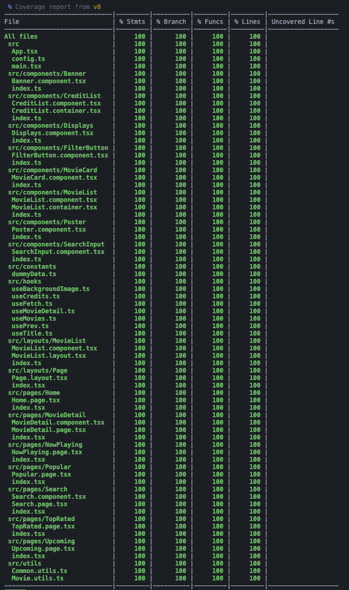

# 🎬 Movie App

This is a movie application built with React. It allows users to browse and search for movies.

## 🌐 Live URL

You can access the live application at: [https://react-tmdb-app-mocha.vercel.app/](https://react-tmdb-app-mocha.vercel.app/)

## ✨ Features

- 🔥 Browse popular movies
- 🔍 Search for movies
- 📄 View movie details

## 🚀 Getting Started

To run this project locally, follow these steps:

1. **Clone the repository:**
   ```bash
   git clone <repository-url>
   ```
2. **Navigate to the project directory:**
   ```bash
   cd movie-app
   ```
3. **Create a `.env` file in the root directory (see the .env.example) and add your TMDB API key:**
   ```bash
   VITE_TMDB_API_KEY=your_tmdb_api_key_here
   ```
4. **Install dependencies:**
   ```bash
   pnpm install
   ```
5. **Start the development server:**
   ```bash
   pnpm dev
   ```

## 🛠️ Technologies Used

- ⚛️ React
- 🚦 React Router
- 🎨 Tailwind
- ▲ Vercel

## 🔥 Coverage 100%



## 📄 License

This project is licensed under the MIT License.

## 📧 Contact

For any inquiries, please contact [Amin Yusuf](mailto:si.aminyusuf@gmail.com).
